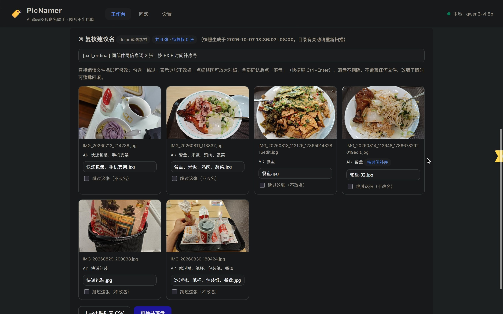
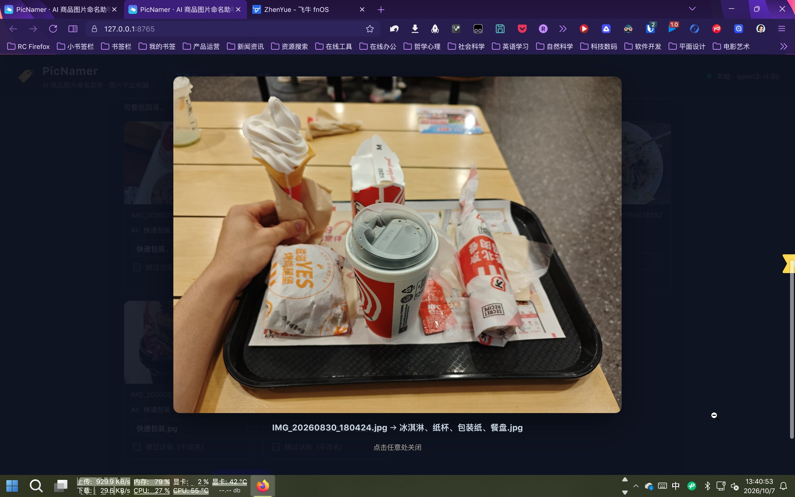
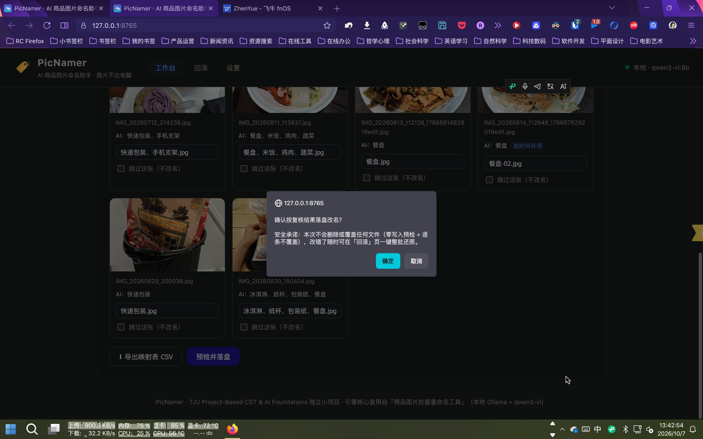
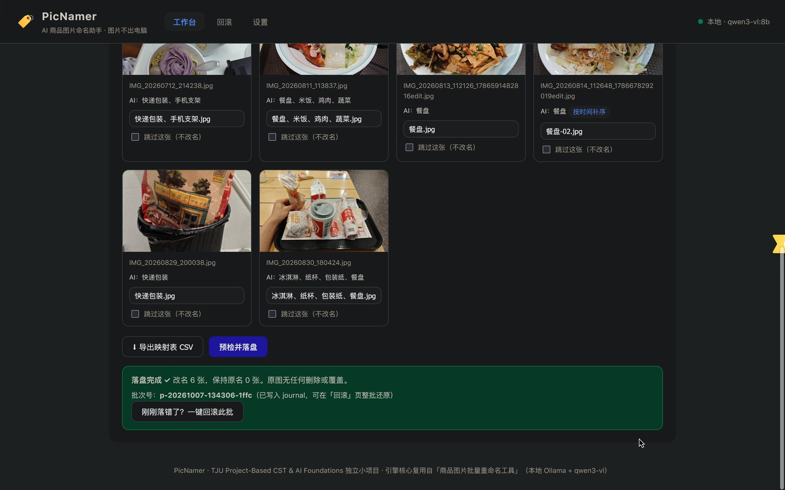
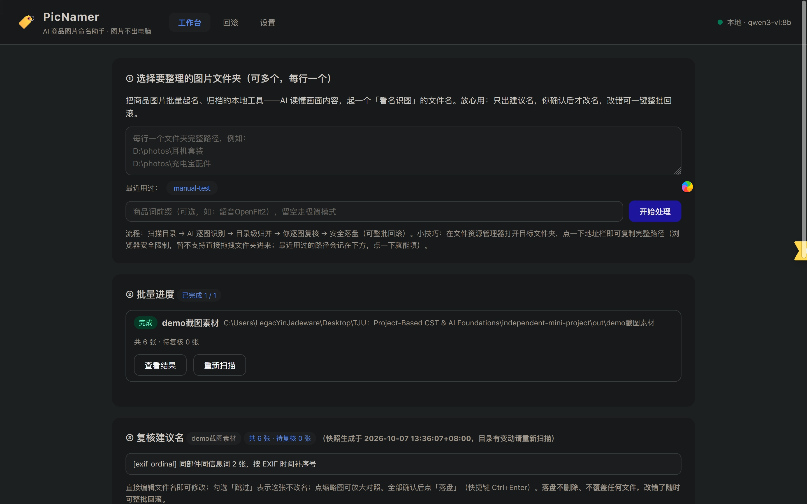
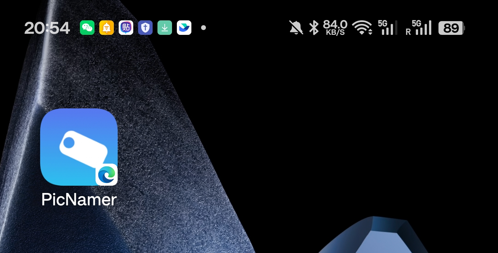
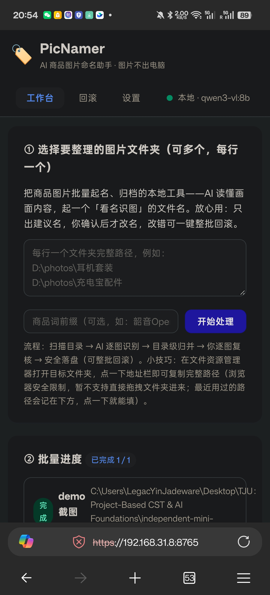

# 商品归档重命名工具（AI 商品图片命名助手 PicNamer）项目报告

> 课程：TJU Project-Based CST & AI Foundations · 个人独立小项目
> 作者：**陈胤璋**
> 日期：2026-10-07 ｜ 提交截止：2026-12-04
> 项目访问方式见附录 A

---

## 一、项目动机

我的商品图片归档库长期使用 `配件或细节-01..NN`、`商品主体-*` 这类无语义命名，无法"据名识图"——前期分析发现仅部件词的写法就多达 **415 种**、近一半只出现过 1 次，分布完全不符合"实物照片为主"的常识。想找某张"充电盒背面"的图，只能逐张肉眼翻。

在上一阶段的项目里，我用本地视觉大模型（Ollama + qwen3-vl:8b）做了一个 **CLI 批量重命名工具**，验证了技术可行性：三段式流水线（逐图取词 → 目录级归并 → 规则后处理）能稳定产出 `部件名-信息词` 形式的规范名（如 `充电盒-正面.jpg`、`棋盘、棋子-正面.jpg`），并沉淀了安全落盘、journal 回滚等 245 个测试用例背后的工程资产。但 CLI 形态对非技术用户不友好，复核流程依赖手写 HTML 预览页。

因此本项目的定位是：**把已验证的 AI 引擎产品化**——做成有完整图形界面的「AI 商品图片命名助手」，让"选文件夹 → AI 起名 → 逐图复核 → 安全落盘/一键回滚"全程可视化，并同时交付网页版与 PWA App 版。这同时正好练习课程强调的"人主导、AI 辅助"协作开发全流程。

**目标用户**：有大量商品/物品照片需要归档的电商卖家、闲置卖家、收藏整理者（包括我自己）；次要用户是任何需要批量整理本地照片命名的人。

## 二、开发过程

全程遵循课程方法论：开发前与 AI 充分沟通生成《项目范围说明（Project Scope）》与《分阶段执行计划》两个核心文档；严格按阶段推进，每阶段走「思考 → 执行 → 测试 → 验证」闭环；AI 自测通过后由我人工验证达标才进入下一阶段；过程记录（开发日志、决策记录 ADR、错误日志）全程留痕。

### 2.1 选题决策（人主导）

与 AI 讨论后我对比了三个方向：A. 把已验证的重命名引擎产品化；B. 扩展为"图片管理台"（命名+去重+标签）；C. 另起全新选题。最终选 **A**：痛点真实且已被前期工作验证、可复用 245 个测试用例背后的工程资产、工作量可控（MVP 原则）。去重/标签列入 v2 Backlog。随后确定四项关键决策（详见 ADR-001~004）：引擎产品化、网页 + PWA 双形态、FastAPI + 原生前端（零构建链）、本地 Ollama 为主 + 云端 API 备选。

### 2.2 阶段一：MVP 核心闭环

移植五模块引擎（取词/归并/命名规则/预检/journal 回滚），新增 Provider 抽象层（本地 Ollama + 云端视觉 API + 进程内串行锁替代原网关进程）与 12 个 API 端点，前端实现工作台/回滚/设置三页。AI 自测 64 个测试用例全绿 + 服务冒烟后，由我人工验证：在测试目录完成"扫描 → 复核（改名/跳过）→ 落盘 → 回滚"全流程，文件名复原一致、冲突被零写入拦截。

### 2.3 阶段二：功能完善与体验优化

新增多目录批量（单活动批次 + JSON 持久化 + 断点续跑，ADR-008）、批次级+图片级双层进度、默认商品词设置、AI 服务启动前预检（不通返回明确指引而非让用户干等）、回滚结果内联展示。测试扩充到 80 例，由我和一位同学分别实测了批量与断点续跑场景。

### 2.4 阶段三：PWA 与交付

实现 manifest + Service Worker（静态壳缓存，`/api/*` 永不缓存）与安装引导按钮；为解决"PWA 安装需要 HTTPS 安全上下文"的问题，编写自签证书生成脚本，`run.ps1 -Lan` 一键以 HTTPS 局域网模式启动，手机可通过 `https://<局域网IP>:8765` 安装到桌面（ADR-009）。最终回归 **84 个测试用例全绿**。

### 2.5 人工实测（2026-10-02）

M3 关口按计划完成真实浏览器人工实测（与 AI 自测互补，覆盖 84 例测试打不到的"真实用户路径"）：

- **端到端全流程**：设置页连接测试 → 工作台粘贴测试目录（6 张图片副本，不动真实照片）→ 批量扫描（AI 逐图识别 + EXIF 时间补序）→ 复核网格（人工改名 1 条、跳过 1 条）→ 落盘确认 → 落盘成功（改名 5、保持原名 1，journal 批次 `p-20261002-015428-680d`）→ 一键回滚 → **文件系统终验：文件名完全复原、内容与源目录逐字节一致**
- **PWA 安装条件验证**：manifest 完整可访问、Service Worker 注册成功且 active、「📲 安装」按钮触发正常（beforeinstallprompt）；原生安装对话框最终点击待真机人工确认
- **发现并修复真实 Bug**：设置页保存后顶栏徽标误显示「云端」（Serial 套 Serial 嵌套，详见问题表第 7 行与错误日志 ERR-007），修复后 85 例测试全绿、浏览器复验通过

### 2.6 工程数据

- 后端 pytest **92 个测试用例**（覆盖安全逻辑：预检零写入、改名环、批内重名、中途失败自动逆序回滚、哈希校验拒绝还原被改文件、大小写不敏感查重、模型输出容错解析、设置保存后 health.provider 正确性回归、缩略图 ETag 失效、目录内容变动重扫等）
- 过程文档：3 份核心文档（范围/计划/报告）+ 3 份过程记录（开发日志/决策记录 10 条 ADR/错误日志 9 条）+ 试用反馈表（3 人完整记录）

### 2.7 试用反馈驱动的迭代（2026-10-07）

3 人试用后一周内，将"马上能做"的 7 项建议全部实现并回归（详见第五节迭代表），并修复本人实测发现的"目录内容变动后列表过期"问题（缩略图 ETag 失效 + 批量重提交按内容签名自动重扫，ADR-010）。其余建议（命名模板占位符、文件夹拖拽）经评估列入 v2 Backlog，理由见第五节。

## 三、核心功能

真实界面（2026-10-07 采集）：复核网格（缩略图 + AI 建议名 + EXIF 时间补序徽标）与点击缩略图后的放大对照：

1. **AI 批量命名**：本地视觉大模型逐图识别部件 → 目录级归并同义词 → 规则化产出 `部件名-信息词` 命名，多部件同框用「、」连接
2. **可视化复核**：缩略图网格逐图对照，支持单条改名、跳过、待复核徽标提示；键盘 Ctrl+Enter 快捷落盘
3. **批量与断点续跑**：多目录排队逐目录处理，进度双层实时可见；中断后「继续上次批次」自动跳过已完成目录
4. **安全落盘**：预检零写入（覆盖/改名环/批内重名三种物理冲突直接拦截）→ 写前 journal → 逐条不覆盖 → 异常自动逆序回滚
5. **一键整批回滚**：按批次号逆序还原，内容哈希校验拒绝还原被外部改过的文件
6. **双 AI 推理源**：本地 Ollama（默认，图片不出电脑）与云端视觉 API（OpenAI 兼容协议）可在设置页一键切换，Key 仅存本地
7. **双形态交付**：网页版 + PWA 可安装 App（含局域网 HTTPS 安装方案）

## 四、开发中遇到的问题及解决方法

| # | 问题 | 解决 | 教训 |
|---|---|---|---|
| 1 | **移植中发现原引擎死代码**：「、」边界裁剪函数的回退分支因判断条件恒假而从未生效，超长多部件名会留下"半个词"碎片名，与文档承诺相悖 | 移植时按文档意图重写为按成员累积裁剪（ADR-005），补两种裁剪路径的测试 | 移植不是复制：用测试逼出真实行为，再决定保留还是修正 |
| 2 | **过期的冲突标记误拦落盘**：AI 发现命名冲突后，我人工把名字改开了，落盘仍被旧标记拦截，怎么都过不去（M1 人工验证发现） | 落盘前重算冲突：只有"静默序号仍在"才拦截，人工改过名即视为确认（ADR-007） | 过程态数据在下游使用前要问"它还成立吗" |
| 3 | **端口冲突 + 缓存串扰**：与另一个常驻本机的订阅项目抢 8000 端口，浏览器把旧项目的缓存界面递回来，页面"撞车" | PicNamer 改用 8765 端口（ADR-006），清理旧源 Service Worker | 浏览器按"源"记忆状态，端口是部署时要主动避让的资源 |
| 4 | **批内重名未被预检拦截**：复核时把两张图改成同一个名字，原预检查不出，靠运行时回滚兜底 | 预检新增 `dst_duplicate` 批内同名零写入拦截 | Windows 的 rename 会静默覆盖，物理冲突要在写盘前拦 |
| 5 | **AI 服务未启动时体验差**：每个图都重试失败、产出整目录兜底词 | 任务启动前预检服务连通性，不通直接返回明确指引 | 快速失败 + 指引优于慢速失败 |
| 6 | **工具链截断源码文件**：一次文件编辑把 apply.py 中段整体截掉，但残留代码语法合法，编译检查不报错 | 测试收集时 ImportError 暴露；整文件重写并新增"符号完整性检查"步骤 | 语法检查之后必须跑测试——测试是真正有效的安全网 |
| 7 | **设置保存后状态徽标误显示「云端」**（人工实测发现）：SerialProvider 被嵌套包装，health 读到外层的 name="serial"，前端一律显示成"云端" | 最小修复：swap 只换内层 Provider；新增"保存后 health.provider 正确性"回归测试（详见错误日志 ERR-007） | 包装类的 swap 目标必须是"被包装对象"；保存后读状态的路径要进集成测试 |
| 8 | **启动脚本解析报错**：run.ps1 是 UTF-8 无 BOM 编码，PowerShell 5.1 按 ANSI 误读中文，多字节序列破坏语法，用户启动即报"意外的标记 }"（旧版能跑纯属字节运气） | 重写脚本并强制写入 BOM；发布前用 Parser::ParseFile 做静态解析检查；附纯 ASCII 的 .bat 双击启动器 | Windows 下含非 ASCII 的 .ps1 必须带 BOM |
| 9 | **目录内容变动后列表过期**（本人实测 + 用户反馈）：同名路径替换图片后缩略图仍显示旧图；重提交同批目录时"断点续跑跳过已完成"直接沿用旧快照，新扫的图不出现 | 缩略图改为 ETag（mtime+size）再验证，文件一变即失效；重提交时按目录内容签名（名+大小+mtime）自动检测变动并重新处理，纯续跑语义保留（ADR-010） | "跳过已完成"的续跑优化与"内容要新鲜"是两个场景，必须分开设计 |
## 五、他人试用反馈

（3 人试用：2026-10-05 ~ 10-06，完整记录见《试用反馈表》；试用者均未看说明书，仅靠界面提示操作）

**试用者 1 · 小林**（大三，闲置电商卖家，62 图，8 分钟，独立完成，4 分）：核心好评是"一屏复核所有建议名、单独改"与商品词前缀；卡点是首屏认知（"还以为是网盘"）与路径输入方式。
**试用者 2 · 王阿姨**（52 岁，家庭相册整理者，38 图，15 分钟，**未完成**，3.5 分）：卡在"不敢信 AI 起的名字、不敢点落盘"——安全感不足而非功能缺失；希望放大看图、确认框一句话讲清"改坏了能不能恢复"。
**试用者 3 · Kevin**（28 岁，跨境电商运营，120 图，5 分钟，独立完成，4.5 分）：重点表扬回滚（"误操作过一次，回滚 10 秒搞定，刚需"）；提出命名模板带 SKU 编号、回滚入口就近、导出映射表三项需求。

**反馈驱动的迭代**（试用后一周内全部实现并回归测试）：

| 反馈 | 落实 |
|---|---|
| 首屏认知（小林） | 工作台加一句话定位引导：「把商品图片批量起名、归档的本地工具」 |
| 扫描结果不明确（小林） | 复核页头部明确显示「共 N 张 · 待复核 M 张」+ 快照生成时间 |
| 放大对照（王阿姨） | 点击缩略图页内放大 1600px，同时显示 原名 → 新名 |
| 安全承诺（王阿姨） | 落盘确认框直接承诺「不删除、不覆盖任何文件，随时一键回滚」 |
| 字体太小（王阿姨） | 全局字号、按钮、输入框加大 |
| 回滚入口太深（Kevin） | 落盘完成页内嵌「刚刚落错了？一键回滚此批」按钮 |
| 映射表导出（Kevin） | 复核页一键导出 CSV（原名/新名/AI部件/信息词，Excel 兼容） |
| 路径输入繁琐（小林） | 最近用过的路径一键填入；真·文件夹拖拽受浏览器安全限制（拿不到绝对路径），列入 v2 |
| 命名模板 SKU 占位符（Kevin） | v2 Backlog（需设计占位符语法与冲突消解交互） |

**迭代后的回归验证**：新增 7 个测试用例覆盖全部改动（缩略图 ETag 失效、CSV 内容、目录变动重扫、resume 语义不变等），92 例全绿；并据本人实测发现的"目录变动列表过期"问题修复了缩略图缓存与批量刷新两层根因。

**报告配图**（2026-10-07 真实界面采集，原图见 `images/`）：

复核网格（PC 端）——缩略图 + AI 建议名 + EXIF 时间补序徽标 + 快照时间提示：

落盘确认框——试用者 2 建议的「安全承诺」置顶展示：

落盘成功页——试用者 3 建议的「刚刚落错了？一键回滚」就近入口：

批量进度面板——目录状态徽标与「查看结果 / 重新扫描」操作：

点击缩略图放大对照（1600px，原名 → 新名）——回应试用者 2「看不清是哪张」：

PWA 真机验证（Android + Edge）：桌面图标与独立 App 窗口：

## 附录 A · 项目访问方式

- **网页版**：运行 `run.ps1` → 浏览器打开 `http://127.0.0.1:8765`（首次运行自动配置环境）
- **App 版（PWA）**：本机桌面浏览器（Chrome/Edge）地址栏右侧可直接安装；手机与电脑同一局域网时运行 `run.ps1 -Lan`，手机浏览器访问 `https://<局域网IP>:8765`（自签名证书，首次需点"继续前往"），菜单中选择"添加到主屏幕"
- **源码**：GitHub 仓库 https://github.com/dxhangsh/picnamer （本地 `independent-mini-project/`，backend + frontend + tools + docs，含 git 版本记录）
- **安装包**：托管于个人主页 `https://dxhangsh.github.io/personal-homepage/PicNamer-installer-v1.0.zip`（解压后双击「启动 PicNamer.bat」，首次运行自动配置环境）
- 项目介绍与访问方式同步发布于个人主页项目板块

## 附录 B · 运行环境

Windows 10+ · Python 3.10+ · Ollama + qwen3-vl:8b（或任意 OpenAI 兼容视觉 API）；无 GPU 时可切云端 API 模式运行。
